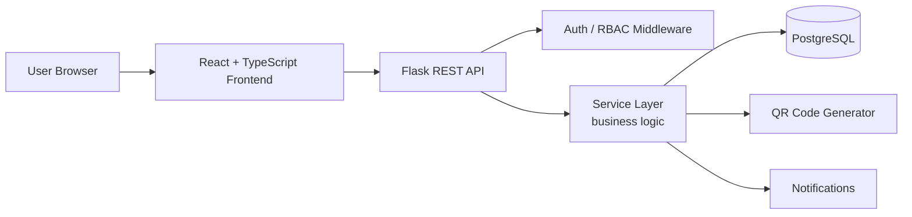
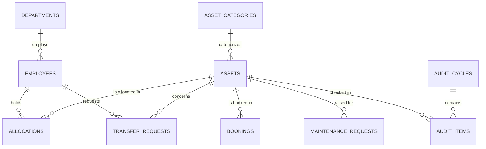
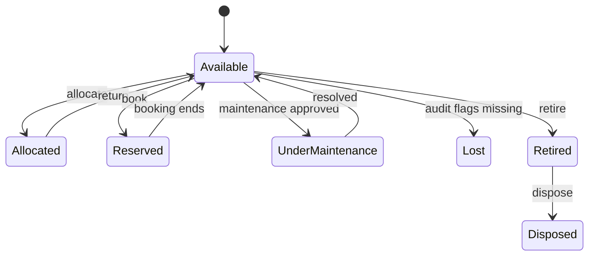
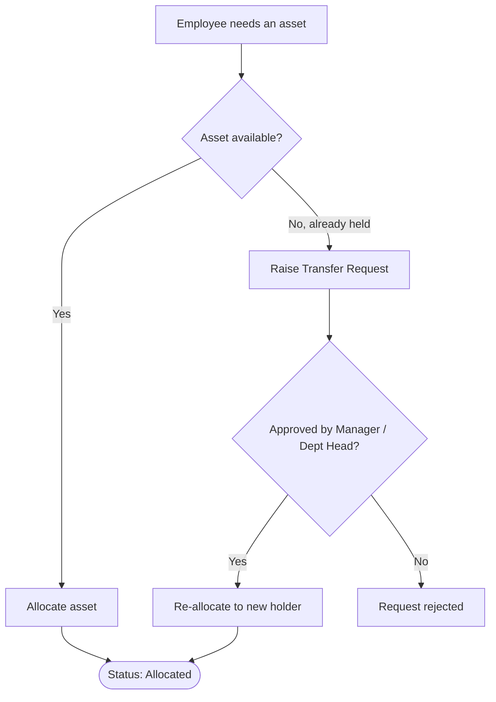
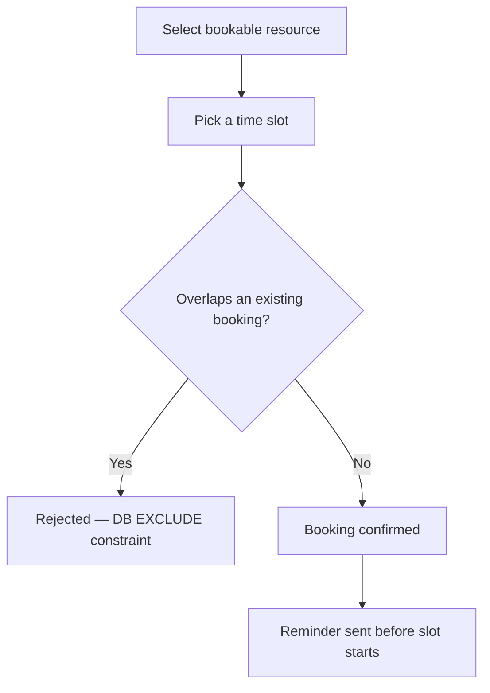
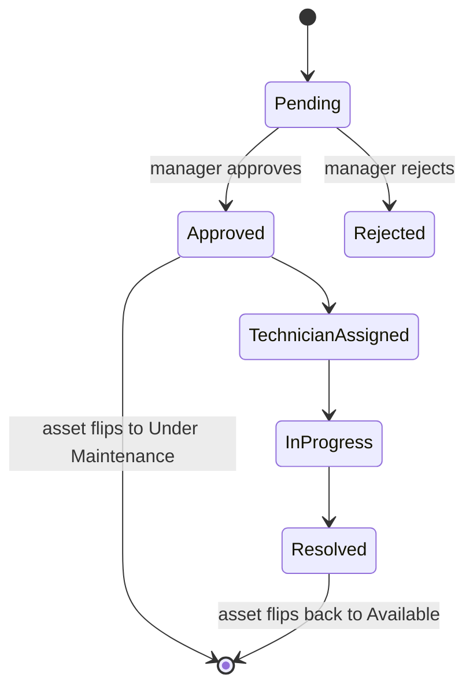
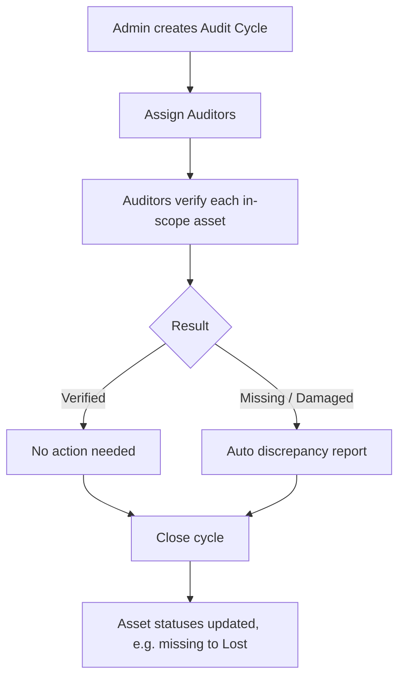

# AssetFlow — Enterprise Asset & Resource Management System

A centralized ERP platform for tracking, allocating, and maintaining physical assets and shared resources. Built for the **Odoo Hiring Hackathon**.

> Replaces spreadsheets and paper logs with structured asset lifecycles, centralized resource booking, and real-time visibility into *who holds what, where it is, and what condition it's in.*

---

## Table of Contents

1. [Overview](#overview)
2. [Tech Stack](#tech-stack)
3. [System Architecture](#system-architecture)
4. [Data Model (ERD)](#data-model-erd)
5. [Project Structure](#project-structure)
6. [Core Workflows](#core-workflows)
7. [Getting Started](#getting-started)

---

## Overview

AssetFlow digitizes how any organization (offices, schools, hospitals, factories) tracks, allocates, and maintains its physical assets and shared resources.

**In scope:** asset lifecycle management, allocation & transfer, resource booking, maintenance approvals, audit cycles, dashboards & notifications, role-based access.

**Deliberately out of scope:** purchasing, invoicing, accounting. Acquisition cost is stored for reporting only — never wired into financial logic.

**Roles:** `Admin` · `Asset Manager` · `Department Head` · `Employee`
Signup only ever creates an **Employee**. Elevated roles are assigned exclusively by an Admin from the Employee Directory — nobody can self-promote.

---

## Tech Stack

| Layer | Choice | Why |
|---|---|---|
| Database | **PostgreSQL** | Enforces the two hardest business rules *at the DB level*: no double-allocation (partial unique index) and no overlapping bookings (`EXCLUDE ... USING gist`). Also gives native `ENUM`, `CHECK` constraints, and `JSONB`. |
| Backend | **Python + Flask + SQLAlchemy** | Explicit, layered (routes → controllers → services → models), migration-driven via Alembic — no ORM magic. |
| Migrations | **Alembic** | Every schema change is a committed, revertable migration. |
| Frontend | **React + TypeScript + Vite** | Compile-time contract checking supports the "no silent failures" rule. Shared design tokens keep the UI consistent. |
| Auth | **In-house session/JWT** | `bcrypt`/`argon2` hashing, custom RBAC middleware — no third-party auth provider. |
| File storage | **Local disk (dev) / S3-compatible (optional)** | Own upload endpoint with MIME/type validation. |
| QR codes | **`qrcode` (self-generated)** | Encodes the Asset Tag for a printable, scannable label. The only "smart" feature — no AI/blockchain/chatbot, since none of it adds real value here. |

**Explicitly avoided:** Firebase, Supabase, MongoDB-as-BaaS, or any external API the core logic would depend on.

---

## System Architecture



**Layering rule:** routes never touch the DB directly, controllers never contain business logic, services never parse HTTP. Reviewers check that every PR's change lives in the correct layer.

---

## Data Model (ERD)

Simplified view — see `docs/ERD.md` for the full schema with all columns and enums.



**Two DB-level integrity showpieces:**

```sql
-- 1. No double-allocation
CREATE UNIQUE INDEX one_active_allocation_per_asset
  ON allocations (asset_id) WHERE status = 'active';

-- 2. No overlapping bookings (requires btree_gist)
ALTER TABLE bookings ADD CONSTRAINT no_overlapping_bookings
  EXCLUDE USING gist (
    resource_asset_id WITH =,
    tsrange(start_time, end_time) WITH &&
  ) WHERE (status <> 'cancelled');
```

App-level checks still exist for friendly error messages, but the database is the final line of defense so a race condition can never corrupt state.

---

## Project Structure

```
assetflow/
├── backend/
│   ├── app/
│   │   ├── models/         # SQLAlchemy models
│   │   ├── routes/         # thin HTTP layer (blueprints)
│   │   ├── controllers/    # request parsing + response shaping
│   │   ├── services/       # business logic
│   │   ├── schemas/        # request/response validation
│   │   ├── middleware/     # auth, RBAC, error handler, logging
│   │   └── utils/          # asset tag gen, qr, notifications
│   ├── migrations/         # Alembic
│   └── tests/
├── frontend/
│   ├── src/
│   │   ├── api/            # typed API client
│   │   ├── components/     # shared design-system components
│   │   ├── pages/           # one folder per screen/module
│   │   ├── context/        # auth/session context
│   │   ├── theme/          # design tokens
│   │   └── router.tsx       # routes + role guards
├── docs/
│   ├── ERD.png / ERD.md
│   └── API.md
└── README.md
```

**Standard API response envelope** (consistent across every endpoint):

```json
{ "success": true,  "data": { }, "message": "..." }
{ "success": false, "error": { "code": "VALIDATION_ERROR", "fields": { "email": "Invalid email format" } } }
```

---

## Core Workflows

### Asset Lifecycle



### Allocation & Transfer



### Resource Booking



### Maintenance Approval



### Audit Cycle



---

## Getting Started

### Prerequisites

- Node.js 18+
- Python 3.11+
- PostgreSQL 14+ with the `btree_gist` extension available

### 1. Enable the Postgres extension (once, per database)

```sql
CREATE EXTENSION IF NOT EXISTS btree_gist;
```

### 2. Backend

```bash
cd backend
python -m venv venv
source venv/bin/activate        # Windows: venv\Scripts\activate
pip install -r requirements.txt

cp .env.example .env            # fill in DB URL, secret keys
alembic upgrade head            # build schema from scratch
python seed.py                  # load demo dataset
flask run                       # boots the API
```

### 3. Frontend

```bash
cd frontend
cp .env.example .env            # points at the backend API URL
npm install
npm run dev
```

### 4. Sanity check

- Health-check endpoint responds.
- Login with a seeded admin account.
- `docs/API.md` lists every endpoint if you need the contract.
